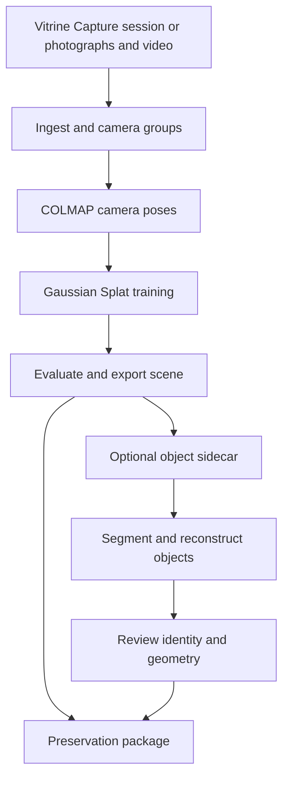

<p align="center">
  
</p>

<p align="center">
  <a href="LICENSE"></a>
  
  
  
  
</p>

<h1 align="center">Vitrine</h1>

**September demo workflow:** use `--quality demo` (now the CLI default),
`preflight --source <capture-folder>`, then `run --source <capture-folder>`.
Failed runs retain completed stages: repeat with the same `--run-dir` and
`run --resume`. The pipeline now explicitly prepares `model/scene.splat` for
the viewer. The measured demo recipe has a 5090 reference result; A6000 runtime
still needs a rehearsal. See [the integration report](docs/demo-merge-report-20260909.md),
[hardware configuration](docs/hardware-config.md), [adaptive ingest](docs/adaptive-ingest.md)
and [optional local mesh providers](docs/local-mesh-provider.md).

Live geometry snapshots are opt-in for `demo` with `VITRINE_LIVE_PREVIEWS=1`;
stage progress and evaluation images remain available. `cleanup` creates a
separate candidate and never replaces the master automatically. iOS remains
experimental: CLI session import is preserved; dashboard iPhone import is
marked coming soon and is not required for the September demonstration.

<p align="center">
  <strong>Local scene reconstruction and reproducible 3D digital preservation, with an experimental object-sidecar workflow.</strong>
</p>

<p align="center">
  Turn photographs and video into a measurable 3D reconstruction while preserving the originals, camera poses, processing history, quality metrics and checksums needed to reproduce it.
</p>

<p align="center">
  No cloud processing · No paid reconstruction service · One pipeline from laptop to workstation
</p>

---

## What is Vitrine?

Vitrine is an open-source, local-first pipeline for preserving physical spaces,
exhibitions and temporary installations as reproducible 3D records.

The core workflow turns photographs and video into a measured 3D Gaussian
Splat, with a local capture library and preservation packaging. An optional,
separately installed object sidecar produces candidate assets for review.
Object identity and clean separation are still experimental on the demo machine.

A preservation package can retain originals, calibrated camera positions,
COLMAP evidence, software versions, model files and SHA-256 checksums.
Evaluation and optional object derivatives must actually be present before
claiming them as part of an individual archive.

The result is a **digital twin of a moment**: not a live sensor system, but a
reproducible record of a space that may later change or disappear.

## Current status — 6 September 2026

**AMBER: ready for a prepared-scene rehearsal; not yet signed off for the
30 September demo.** The local viewer, full capture library, rename, recoverable
Trash and measured video-only result are available. Clean object isolation,
end-to-end upload recovery, final SpaceMouse tuning and venue rehearsal remain
acceptance gates. See the [demo readiness report](docs/demo-readiness-2026-09-30.md).

This assessment covers the current working tree, which contains uncommitted
changes beyond `856dce1`; it is not a claim that a fresh checkout of that commit
contains the demo features or installed sidecar.

## Designed for ease of use

Vitrine includes a local graphical interface so routine captures do not need
to be managed entirely from the command line.

```bash
python -m vitrine ui --open
```

The interface opens at `http://127.0.0.1:8765/` and provides a visual workspace
for:

- creating a reconstruction from local photographs and video;
- choosing a suitable quality profile;
- following processing progress and logs;
- browsing all completed and in-progress captures, with search and filters;
- renaming captures and moving them to recoverable Trash;
- reviewing reconstruction statistics and quality measurements;
- exploring Gaussian Splats with saved viewpoints, reset and presentation mode;
- connecting a SpaceMouse through WebHID, with speed and direction controls;
- reviewing experimental object candidates and their actual 3D outputs;
- inspecting archive contents and preservation metadata.

The viewer libraries and UI fonts are bundled locally. Installation and initial
model downloads require network access; a fresh offline venue rehearsal remains
to be completed. SpaceMouse requires a WebHID-capable browser and device consent;
physical movement now works, but the latest navigation tuning awaits acceptance.

Rename changes a display label without rewriting archive metadata. Delete moves
a capture into `runs/.trash`; restore refuses to overwrite another capture. Trash
does not free disk space. Finish externally launched jobs before moving their
run folders; the dashboard cannot track every external process.

All processing remains on the local computer. The GUI is a user-friendly layer
over the same reproducible pipeline; the CLI remains available for research,
automation and stage-by-stage control.

| Create from photographs or video | Inspect the archive beside the live viewer |
|---|---|
|  |  |

These screenshots document an earlier interface revision; the current workspace
uses the Images → 3D splat → Objects journey.


## Built for temporary cultural spaces

Vitrine was developed at the **XR Lab, University of Salford**, initially to
preserve **Nested Cinema — *Vera's Not Alone*** by Dr Pavel Prokopic at
MediaCityUK.

The installation combined physical scenery, newspaper-clad structures,
screens and immersive film. Once dismantled, its spatial experience could no
longer be revisited through ordinary photographs alone. This made it an ideal
test case for a larger question:

> How can an experimental 3D reconstruction become a trustworthy and reusable preservation record?

## Key capabilities

| Capability | What it provides |
|---|---|
| Accessible local GUI | Create, monitor, inspect and manage reconstructions visually |
| Mobile capture session | iPhone app guides an HQ scan and hands a folder to ingest |
| Local scene reconstruction | Produces a Gaussian Splat without uploading the capture to a cloud service |
| Photographs and video | Combines detailed stills with continuous video coverage |
| Multi-camera calibration | Keeps phones, lenses, resolutions and video sources correctly separated |
| Lens correction | Corrects COLMAP camera distortion before splat training |
| Measured quality | Evaluates unseen views using PSNR and SSIM |
| Experimental object separation | Optional external sidecar; current Windows demonstration uses GroundingDINO and SAM2.1 |
| Object asset handoff | Validates per-object mesh or Gaussian-splat records; validation does not establish visual correctness |
| Provenance tracking | Distinguishes photographed evidence from inferred or generated surfaces |
| Preservation packaging | Stores originals, poses, models, metadata, derivatives and checksums |
| Laptop-to-workstation profiles | Runs from a 6 GB RTX 3060 Laptop to an RTX 5090 workstation |

## How it works

Guided capture on iPhone is a separate client, **Vitrine Capture**
(`apps/ios-capture/`). It locks exposure, walks the room-scan SOP and exports a
session zip. Import that zip in the dashboard or with
`python -m vitrine ingest --session path/to/session.zip`. The phone does not
reconstruct. See [the session contract](docs/capture-session.md).



Each expensive stage writes a compact report and can be repeated independently.
The complete scene pipeline is also reachable through one command:

```bash
python -m vitrine doctor
python -m vitrine profiles
python -m vitrine --run-dir runs/my-capture --quality standard run
python -m vitrine ui --open
```

## Quick start

Use **Python 3.11**, an NVIDIA GPU, `ffmpeg`, and Docker with GPU access.
COLMAP runs in a container. Prefer 3.11 for CUDA wheel coverage — notably
Open3D has no Python 3.14 wheel, which is why meshing uses pymeshlab.
The dashboard itself no longer imports ``cgi``, so it can start on 3.13.
CUDA compilation also needs a compatible host compiler: Visual Studio C++ Build
Tools on Windows, or a CUDA-compatible GCC on Linux. See [AGENTS.md](AGENTS.md).

Windows PowerShell:

```powershell
git clone https://github.com/ArtechShadow/UOS-Vitrine.git
cd UOS-Vitrine
py -3.11 -m venv .venv
.venv/Scripts/python.exe -m pip install -r requirements.txt
docker pull colmap/colmap:latest
.venv/Scripts/python.exe -m vitrine doctor
.venv/Scripts/python.exe -m vitrine ui --open
```

Linux, after cloning:

```bash
python3.11 -m venv .venv
source .venv/bin/activate
python -m pip install -r requirements.txt
docker pull colmap/colmap:latest
python -m vitrine doctor
python -m vitrine ui --open
```

Use the environment's Python for the commands below. Check the printed server
address: if 8765 is occupied the dashboard can choose another port.

For this prepared Windows demo workspace:

```powershell
# One-click dashboard: Desktop "Vitrine" shortcut, or:
.\output\Vitrine.exe
# Rebuild the launcher:
powershell -NoProfile -ExecutionPolicy Bypass -File scripts/build_launcher.ps1
# Full capture library; optional separator requires its separate installation.
./scripts/start_demo.ps1
# Focus a rehearsal on the master:
./scripts/start_demo.ps1 -Run nested-cinema-04-master
# Enable the locally installed experimental separator:
./scripts/start_demo.ps1 -WithObjects
```

`Vitrine.exe` is a small native launcher. It starts the existing `.venv` dashboard
and opens the browser; it does not pack torch, gsplat, or CUDA. Close the
console window to stop the server.

Do not start multiple servers unintentionally. The sidecar and raw captures are
not included in a fresh checkout. See [sidecar setup](docs/sam2-object-sidecar-setup.md).

Validated on Linux with an RTX 3060 Laptop GPU and Windows 11 with an RTX 5090.
The reconstruction algorithm remains the same; hardware profiles change the
measured resolution, crop, Gaussian cap and iteration settings.

## Capturing and reconstructing a scene

Place source media into separate folders for each camera group. This separation
is functional, not cosmetic: mixing a high-resolution still and a video frame
under one set of camera intrinsics can silently warp the reconstruction.

```text
source/
├── stills/     photographs — the preservation master
└── video/      walkthrough — fills gaps between stills
```

The following CLI syntax selects an explicit profile. Stock workstation profiles
need further validation for this capture; see Quality profiles before training.
Global options (`--run-dir`, `--quality`, `--tier`) precede the subcommand.

Run ingest, SfM, training and packaging:

```bash
python -m vitrine --run-dir runs/my-capture --quality standard run \
    --title "My Installation" \
    --subject "What was captured and why it matters."
```

Or work stage by stage:

```bash
python -m vitrine --run-dir runs/my-capture ingest
python -m vitrine --run-dir runs/my-capture sfm
python -m vitrine --run-dir runs/my-capture --quality standard train
python -m vitrine --run-dir runs/my-capture evaluate
python -m vitrine --run-dir runs/my-capture package --title "..." --subject "..."
```

`run` does not invoke the separate `evaluate` command. Run evaluation explicitly
and package again if the archive should include that report. Training metrics
and saved-PLY evaluation are distinct records.

Make an early registration check while the subject still exists. It answers the most
important early question — whether the capture has enough overlap to register —
before a temporary installation is dismantled.

## Object segmentation and reconstruction

Object processing is optional and deliberately separated from the core
MIT-licensed environment. Vitrine invokes an external reconstruction sidecar
as a subprocess, keeping its heavyweight dependencies and model licences out
of this repository.

```bash
python -m vitrine --run-dir runs/my-capture objects \
    --sidecar /path/to/object-sidecar
```

The configured executable must accept the core file-handoff contract; an arbitrary
Python executable or an unadapted external module is not sufficient. Extra
arguments use repeated `--sidecar-arg` options. The dashboard also accepts
`VITRINE_OBJECT_SIDECAR` and `VITRINE_OBJECT_SIDECAR_ARGS_JSON`.

The current Windows test uses public SAM2.1 as an alternative to the gated
SAM3.1 checkpoint. Two real 40-frame passes produced six Gaussian subsets in
54.53 and 51.74 seconds of pipeline time, excluding model loading and final
export. These are **experimental candidates, not six verified isolated objects**:
visual review found fragments and a source-crop/object mismatch. No generated
GLB or composed-scene demonstration has been accepted on this workstation.
See the [sidecar review](docs/demo-object-sidecar-review.md).

The [research closeout report](report/closeout-report.pdf) contains separate
TRELLIS.2/ReconViaGen and composed-scene experiments from another environment.
Those results should not be presented as reproduced Windows demo capabilities.

The sidecar writes `runs/<name>/objects/objects.json`, schema `vitrine/object/1`,
plus referenced assets. The core validates paths, hashes and typed asset records
before accepting them. Each object declares a mesh or a Gaussian splat; schema
and checksum validation do not verify object identity or geometric accuracy.
Optional accepted derivatives can be included when packaging. Existing archives
are not automatically refreshed when new candidates are produced.

## Measured scene results

| Run | Hardware | Views | PSNR | SSIM | Time |
|---|---|---:|---:|---:|---:|
| `nested-cinema-01` | RTX 3060 Laptop, 6 GB | 222 | 25.72 dB | 0.817 | 60.4 min |
| `nested-cinema-01-5090-control` | RTX 5090 | 222 | 25.06 dB | 0.821 | **2.4 min** (~25×) |
| `nested-cinema-04-master` | RTX 5090 | 736 | 22.91 dB | 0.778 | 8.7 min |
| Video-only, appearance OFF | RTX 5090 | 200 (25 held out) | 31.007 dB | 0.946975 | 4.3 min training |

The 5090 control reproduces the laptop recipe at approximately the same quality
in a fraction of the time. The larger `nested-cinema-04-master` result is scored
against a broader and more difficult held-out set spanning five camera groups,
so its figures are not directly comparable with the 222-view baseline.

The first two rows are historical pre-undistortion results. Master figures are
stored export metrics; it still lacks a separate canonical evaluation report.
The video row scores the saved SH3 PLY, not the SH0 browser derivative. All times
are training observations, not complete capture-to-archive turnaround.

In the matched video test, turning appearance compensation off improved the
saved PLY by **4.440 dB PSNR and 0.005743 SSIM**; it is now the training default.
Ingest took 194.9 seconds and SfM 10.06 minutes before training. The video result
has no preservation package yet. See [recipe, limitations and evidence](docs/demo-video-quality-20260906.md).

Held-out views are excluded from photometric training, but contribute to SfM.
Nearby video frames are correlated. Metrics from different captures/splits are
not a direct quality ranking, and do not establish unseen-surface accuracy.

### Reconstruction evidence

The current master registers **736 views across five calibrated camera
groups** and retains **404,570 sparse COLMAP points**. The visualisations below
come from the real reconstruction rather than a synthetic example.

| Registered sparse point cloud | Recovered camera coverage |
|---|---|
|  |  |

The matched-view comparison shows a source photograph beside a render from the
same recovered camera. It makes both the achievement and the remaining loss of
fine newspaper and fabric detail visible.


## Research findings

### Lens distortion was the largest quality fault

COLMAP recovered real radial distortion for every camera, while the gsplat
rasteriser assumed an ideal pinhole model. Correcting images and intrinsics
before training improved the matched 736-view experiment by **4.93 dB PSNR**,
**0.155 SSIM**, and raised live Gaussians from **6.3% to 42.6%**.

This also explained why large crops had appeared harmful: they reached further
into the uncorrected image corners. Full record:
[`docs/undistortion-finding.md`](docs/undistortion-finding.md).

### Frame coverage controls training health

A random crop must revisit enough of each frame for reconstruction gradients to
counter global opacity and scale regularisation. In the measured tests, crop
coverage below approximately 50% collapsed the live Gaussian population.

The validated high-quality recipe uses a 2304-pixel source with a 1536-pixel
crop (67% coverage). Full record:
[`docs/nested-cinema-04-master.md`](docs/nested-cinema-04-master.md).

### Object carving needs visual acceptance

Depth gating and multi-view votes can still include surrounding geometry or the
wrong nearby object. The Windows candidate review remains below the acceptance
threshold for clean object separation; high vote confidence is not accuracy.

## Quality profiles

```bash
python -m vitrine profiles
```

This prints the shipped settings and **estimates**, not guaranteed processing
times. The CLI defaults to `archive` when no quality is supplied.

The stock workstation source/crop pairs are draft 2048/800, standard 3200/1280
and archive 4096/1600. Each has a nominal crop-to-long-edge ratio below 0.5;
actual sampled area depends on image dimensions. Do not treat stock `standard`
as a validated equivalent of the successful HQ experiment. The workstation
Archive preset remains explicitly unvalidated; no profiles were changed by this
documentation audit.

The measured HQ recipe uses source 2304 / crop 1536. The existing
[master script](scripts/run_nested_cinema_04_master.py) is capture-specific and
reuses known poses; it is not a generic new-capture command. The
[video experiment](docs/demo-video-quality-20260906.md) records its own fresh
registration and reproducible comparison. Use prepared, reviewed outputs for
the presentation until the chosen new-capture profile is rehearsed.

## What comes out

```text
runs/<name>/
├── ingest/      staged frames and selection report
├── sfm/         COLMAP database, camera poses and sparse reconstruction
├── model/       full-SH scene.ply and measured results
├── objects/     optional sidecar manifest and per-object assets
└── archive/     checksummed preservation package
```

The archive can contain:

```text
archive/
├── originals/             untouched source photographs and video
├── sfm/                   camera poses and sparse cloud in plain text
├── model/                 full spherical-harmonic Gaussian Splat
├── derivatives/
│   ├── web access copies and conventional geometry
│   └── objects/           validated object meshes and composed scene
├── manifest.json          versions, parameters, metrics and SHA-256 inventory
└── README.md              plain-language preservation record
```

Verify a package later with:

```bash
python -m vitrine verify runs/my-capture/archive
```

Checksums detect change or corruption; they complement rather than replace a
real backup and preservation policy.

## Honest limitations

- A Gaussian Splat is an interpolation, not a direct geometric measurement.
- Surfaces that were never photographed must be inferred.
- Reflective, transparent and moving materials remain difficult.
- Object reconstructions can contain generated geometry or texture on unseen
  surfaces; Vitrine records that distinction rather than hiding it.
- COLMAP scale is arbitrary unless the capture includes an external scale
  reference.
- PSNR and SSIM measure novel-view appearance, not absolute geometric accuracy.

These limitations are part of the preservation record because uncertainty is
information, not an implementation detail.

## Documentation

| Document | What it covers |
|---|---|
| [`AGENTS.md`](AGENTS.md) | Design rationale, measurements and environment traps |
| [`docs/capture-sop.md`](docs/capture-sop.md) | How to photograph a room for reconstruction |
| [`docs/preservation.md`](docs/preservation.md) | Archive structure, provenance and limitations |
| [`docs/undistortion-finding.md`](docs/undistortion-finding.md) | Lens-distortion investigation and measured fix |
| [`docs/nested-cinema-04-master.md`](docs/nested-cinema-04-master.md) | Full record behind the current scene result |
| [`docs/PROJECT-PLAN.md`](docs/PROJECT-PLAN.md) | Roadmap and module status |
| [`docs/progress.md`](docs/progress.md) | Backward-looking implementation record |
| [`docs/demo-readiness-2026-09-30.md`](docs/demo-readiness-2026-09-30.md) | Current demo status, evidence, gaps and rehearsal plan |
| [`docs/demo-ui-review.md`](docs/demo-ui-review.md) | UI, capture management and device acceptance record |
| [`docs/demo-video-quality-20260906.md`](docs/demo-video-quality-20260906.md) | Matched video-only saved-PLY quality experiment |
| [`report/closeout-report.pdf`](report/closeout-report.pdf) | Research closeout; separate environment and acceptance limits |

## Project boundaries and collaboration

The core UOS Vitrine repository owns scene capture, Gaussian Splat training,
evaluation, archive packaging, the local GUI, and the secure contract through
which object assets enter the preservation record.

The object-segmentation and reconstruction models remain a separate sidecar.
This separation protects the MIT-licensed core from incompatible model and
software licences while preserving a stable, checksummed file handoff.

Vitrine is developed in collaboration with **DreamLab AI**. The separate
GPL-licensed [DreamLab-AI/Vitrine](https://github.com/DreamLab-AI/Vitrine)
stack explores downstream segmentation, meshing and Unreal Engine delivery.
The projects share a research direction but remain distinct codebases.

## Acknowledgements

Built at the **XR Lab, University of Salford**, for the preservation of
*Nested Cinema — Vera's Not Alone* by Dr Pavel Prokopic, MediaCityUK, in
collaboration with **DreamLab AI**.

<p align="left">
  
  &nbsp;&nbsp;
  
  &nbsp;&nbsp;
  
</p>

## Licence

[MIT](LICENSE)
