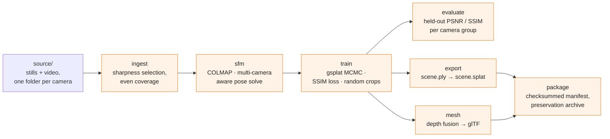
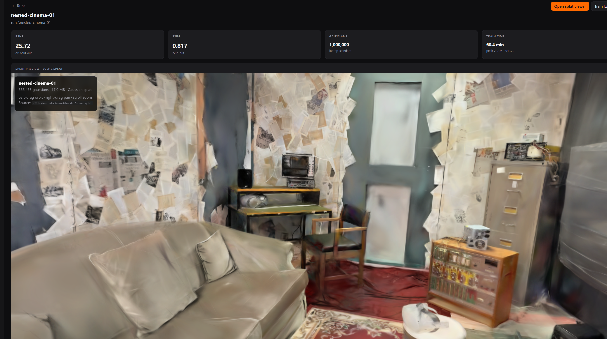

<p align="center">
  
</p>

<p align="center">
  <a href="LICENSE"></a>
  
  
  
</p>

<p align="center">
  Local, reproducible <b>3D Gaussian Splatting for digital preservation</b>.<br>
  No cloud services. No paid software. One CLI, one codebase, laptop to workstation.
</p>

---

Vitrine turns photographs and video of a physical space into a high-quality 3D
Gaussian Splat, together with the sidecar material — original files, camera
poses, software versions, checksums — that makes the result reproducible,
verifiable, and intelligible years later.

Built for the University of Salford's capture of **Nested Cinema** (*Vera's Not
Alone*, Dr Pavel Prokopic, MediaCityUK) — a temporary immersive film
installation that, once de-installed, exists only as documentation.

## Why this exists

Cloud splat services are convenient but they are a black box: you cannot audit
what they did, you cannot re-run them in ten years, and you cannot deposit
their internals in an archive. For preservation that is disqualifying.

The other half is quality. A splat trained the naive way looks acceptable in
motion and falls apart the moment you need to *read* something in it — which,
for an installation whose walls are papered with newspaper clippings, is the
entire point.

Every design decision here is backed by a measurement, not a guess — see
[`AGENTS.md`](AGENTS.md) and [`docs/`](docs/) for the full record, including
the negative results.

## How it works



Every stage is reachable through one CLI:

```bash
python -m vitrine doctor      # checks the machine can run the pipeline
python -m vitrine profiles    # shows the hardware-profile table
python -m vitrine run --run-dir runs/my-capture --quality standard
python -m vitrine ui --open   # local dashboard over runs/
```

## What was found along the way

The headline result isn't the splat — it's the diagnostic trail. A long-running
quality bug ("large training crops cause the model to collapse") turned out to
have nothing to do with crop size:

| | as shot | undistorted |
|---|---:|---:|
| PSNR, held out | 14.18 dB | **19.11 dB** |
| SSIM | 0.534 | **0.689** |
| Live Gaussians | 6.3% | **42.6%** |

Every camera COLMAP solves for this capture comes back with real lens
distortion — `gsplat`'s rasteriser assumes a pinhole camera, and nothing had
ever corrected for it. Distortion error grows with distance from the image
centre, so *larger* crops of *larger* source images reached further into the
uncorrected corners — which is exactly what made crop size look like the
cause. Fixing the actual bug reversed the conclusion: bigger crops help, once
the lens is accounted for. Full write-up: [`docs/undistortion-finding.md`](docs/undistortion-finding.md).

That was the largest of six measured findings that took the best full-capture
reconstruction from 19.8 dB to **22.9 dB / 0.778 SSIM** on a 736-view,
five-camera capture spanning three phones, a Polycam session, and a 4K
walkthrough. Full record: [`docs/nested-cinema-04-master.md`](docs/nested-cinema-04-master.md).

## Measured results

| Run | Hardware | Views | PSNR | SSIM | Time |
|---|---|---:|---:|---:|---:|
| `nested-cinema-01` | RTX 3060 Laptop, 6 GB | 222 | 25.72 dB | 0.817 | 60.4 min |
| `nested-cinema-01-5090-control` | RTX 5090 | 222 | 25.06 dB | 0.821 | **2.4 min** (~25×) |
| `nested-cinema-04-master` | RTX 5090 | 736 | 22.91 dB | 0.778 | 8.7 min |

The 5090 control reproduces the laptop recipe's exact quality at a fraction of
the time. `04-master` is not a regression from the 25.72 dB baseline — it is
scored against a much larger and harder held-out set (three camera types
instead of one, including low-resolution and motion-blurred frames). See the
doc above for why these numbers aren't directly comparable.

## Quality profiles

```bash
python -m vitrine profiles   # show the table and the detected tier
```

| | draft | standard | archive |
|---|---|---|---|
| purpose | did the capture work? | good result | deposit quality |
| laptop (6 GB) | ~3 min | ~40 min | ~110 min |
| workstation (24–32 GB) | ~3 min | ~60 min | ~275 min (est.) |

Always shoot a `draft` first — it answers the only question that matters
early, whether the capture has enough overlap to register at all, in minutes
rather than hours.

> **Known gap:** the workstation `archive` preset (`crop=1600` /
> `source_long_edge=4096`) predates the frame-coverage finding above and is
> **not yet revalidated** — it can collapse the same way the crop investigation
> did before the real cause was found. `standard` is solid on both tiers today;
> reproduce the best measured workstation result with
> [`scripts/run_nested_cinema_04_master.py`](scripts/run_nested_cinema_04_master.py)
> until the profile itself is corrected. Working agreement in `AGENTS.md`:
> unvalidated numbers get measured or reverted, never shipped quietly.

## Install

Requires Python 3.11+, an NVIDIA GPU, `ffmpeg`, and Docker (COLMAP runs in a
container on both platforms).

```bash
python -m venv .venv
source .venv/bin/activate          # Windows: .venv\Scripts\activate
pip install -r requirements.txt

docker pull colmap/colmap:latest   # ~9 GB
python -m vitrine doctor           # catches a missing CUDA host compiler
                                    # or broken Docker GPU passthrough early
```

Validated on Linux (RTX 3060 Laptop) and Windows 11 (RTX 5090, Blackwell). The
same algorithm runs on both — only the numbers in `vitrine/profiles.py` change
between tiers.

## Use

Put source media in `source/`, one subfolder per camera — the subfolder split
is not cosmetic, each becomes its own COLMAP camera model, and mixing a 25 MP
phone still with a 720p video frame under one set of intrinsics silently warps
the reconstruction rather than erroring:

```
source/
├── stills/     photographs — the preservation master
└── video/      walkthrough — fills the gaps between stills
```

Then either run the whole thing:

```bash
python -m vitrine run \
    --run-dir runs/my-capture \
    --quality archive \
    --title "My Installation" \
    --subject "What was captured, in a sentence or two."
```

or a stage at a time, which is what you want while iterating:

```bash
python -m vitrine --run-dir runs/my-capture ingest
python -m vitrine --run-dir runs/my-capture sfm
python -m vitrine --run-dir runs/my-capture train
python -m vitrine --run-dir runs/my-capture package --title "..." --subject "..."
```

### Local dashboard

```bash
python -m vitrine ui --open
```

Opens `http://127.0.0.1:8765/` — stage status, PSNR/SSIM history, ingest
samples, logs, and a splat viewer over everything in `runs/`.

<p align="center">
  
</p>

### Checking a package later

```bash
python -m vitrine verify runs/my-capture/archive
```

Re-hashes every file against the manifest. The package also carries a
standalone copy of this check in its own `README.md`, so it stays verifiable
even if this tool is long gone.

## What comes out

```
runs/<name>/
├── ingest/     staged frames, one folder per camera + a selection report
├── sfm/        COLMAP database and the sparse model as plain text
├── model/      scene.ply (full spherical harmonics) + metrics
└── archive/    the preservation package — see docs/preservation.md
```

Quality is **measured, not asserted**: every 8th view is held out of training
and the final PSNR and SSIM against those unseen views are recorded in
`model/train.json` and in the package manifest.

## Documentation

| Document | What it covers |
|---|---|
| [`AGENTS.md`](AGENTS.md) | Design rationale, measurements, environment traps — read before touching the trainer or profiles |
| [`docs/undistortion-finding.md`](docs/undistortion-finding.md) | The lens-distortion bug: what broke, why it looked like a crop-size problem, the fix |
| [`docs/nested-cinema-04-master.md`](docs/nested-cinema-04-master.md) | The full six-finding record behind the current best result |
| [`docs/PROJECT-PLAN.md`](docs/PROJECT-PLAN.md) | Roadmap and module status |
| [`docs/progress.md`](docs/progress.md) | Backward-looking record of what has actually landed |
| [`docs/capture-sop.md`](docs/capture-sop.md) | How to shoot a room so it reconstructs well |
| [`docs/preservation.md`](docs/preservation.md) | What the archive package contains and why |
| [`docs/5090-port-handoff.md`](docs/5090-port-handoff.md) | Porting the pipeline from Linux/RTX 3060 to Windows/RTX 5090 |

## Related project — DreamLab Vitrine

This pipeline is developed in collaboration with **DreamLab AI**, whose
separate, GPL-licensed *Vitrine* lab stack ([DreamLab-AI/Vitrine](https://github.com/DreamLab-AI/Vitrine))
handles object segmentation, meshing, and Unreal Engine 5.8 delivery. Same
family name, different codebases and different licences — this repository
does not depend on it and must not modify it, and it must not be merged into
this one.

This repository is the **preservation pipeline** — archival master and
measured splat. Where the two systems meet, the intended seam is a file-based
handoff (registered images, COLMAP poses, `scene.ply`, checksummed manifest),
not a shared codebase.

Also separate: **Vitrine Capture**, a FastAPI + React capture front-end.

## Acknowledgements

Built at the **XR Lab, University of Salford**, for the preservation of
*Nested Cinema — Vera's Not Alone* by Dr Pavel Prokopic, MediaCityUK, in
collaboration with **DreamLab AI**.

<p align="left">
  
  &nbsp;&nbsp;
  
  &nbsp;&nbsp;
  
</p>

## Licence

[MIT](LICENSE)
