<p align="center">
  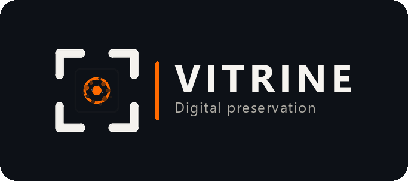
</p>

<p align="center">
  <a href="LICENSE"></a>
  
  
  
  
</p>

<h1 align="center">Vitrine</h1>

<p align="center">
  <strong>A local, GUI-driven platform for scene reconstruction, object segmentation and reproducible 3D digital preservation.</strong>
</p>

<p align="center">
  Turn photographs and video into a measurable 3D reconstruction while preserving the originals, camera poses, processing history, quality metrics and checksums needed to reproduce it.
</p>

<p align="center">
  No cloud processing · No paid reconstruction service · One pipeline from laptop to workstation
</p>

---

## What is Vitrine?

Vitrine is an open-source, local-first pipeline for preserving physical spaces,
exhibitions and temporary installations as reproducible 3D records.

It combines two connected workflows:

1. **Scene reconstruction** — photographs and video are processed into a
   measured 3D Gaussian Splat of the complete environment.
2. **Object reconstruction** — an optional external sidecar can identify and
   segment objects, reconstruct them as individual 3D assets and place them
   back into a composed scene.

The visual model is not treated as the complete result. A Vitrine archive can
also contain original capture media, calibrated camera positions, COLMAP
evidence, software versions, held-out quality measurements, reconstructed
object meshes, provenance records and SHA-256 checksums.

The result is a **digital twin of a moment**: not a live sensor system, but a
reproducible record of a space that may later change or disappear.

## Designed for ease of use

Vitrine includes a local graphical interface so routine captures do not need
to be managed entirely from the command line.

```bash
python -m vitrine ui --open
```

The interface opens at `http://127.0.0.1:8765/` and provides a visual workspace
for:

- creating a reconstruction from local photographs and video;
- choosing a suitable quality profile;
- following processing progress and logs;
- browsing completed and in-progress captures;
- reviewing reconstruction statistics and quality measurements;
- exploring Gaussian Splats in an interactive viewer;
- viewing object summaries and links to reconstructed assets or composed scenes
  when sidecar output is present;
- inspecting archive contents and preservation metadata.

All processing remains on the local computer. The GUI is a user-friendly layer
over the same reproducible pipeline; the CLI remains available for research,
automation and stage-by-stage control.

| Create from photographs or video | Inspect the archive beside the live viewer |
|---|---|
| 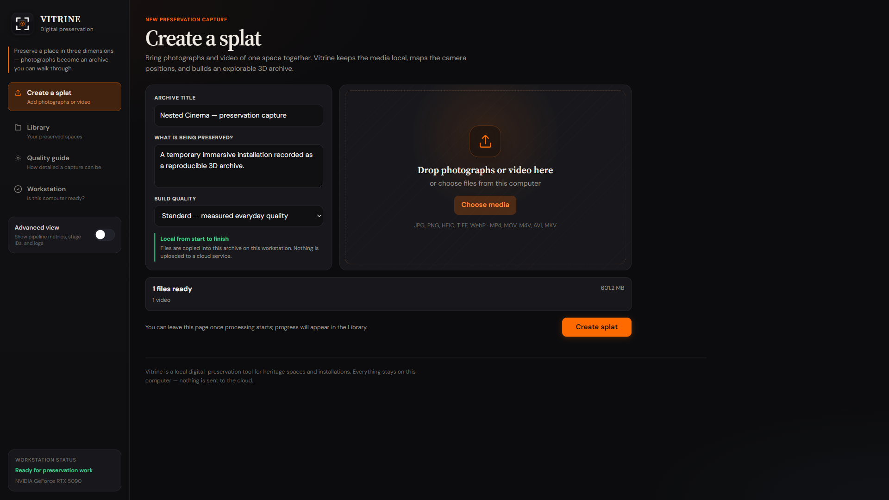 | 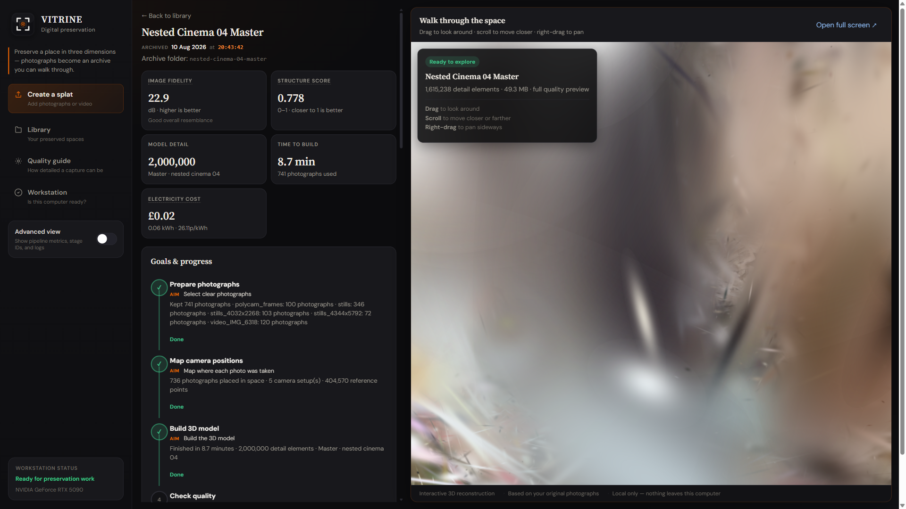 |

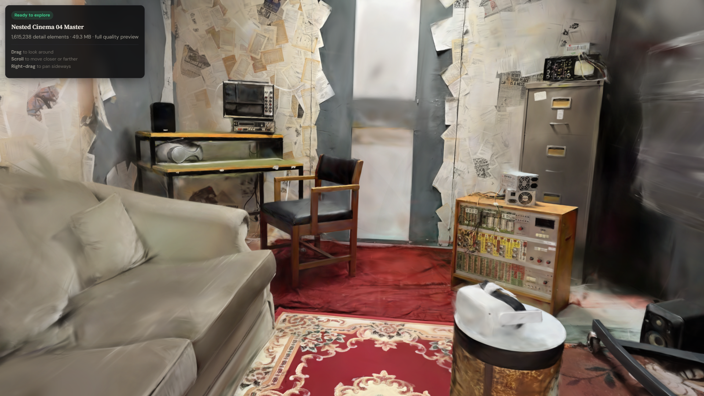

## Built for temporary cultural spaces

Vitrine was developed at the **XR Lab, University of Salford**, initially to
preserve **Nested Cinema — *Vera's Not Alone*** by Dr Pavel Prokopic at
MediaCityUK.

The installation combined physical scenery, newspaper-clad structures,
screens and immersive film. Once dismantled, its spatial experience could no
longer be revisited through ordinary photographs alone. This made it an ideal
test case for a larger question:

> How can an experimental 3D reconstruction become a trustworthy and reusable preservation record?

## Key capabilities

| Capability | What it provides |
|---|---|
| Accessible local GUI | Create, monitor, inspect and manage reconstructions visually |
| Local scene reconstruction | Produces a Gaussian Splat without uploading the capture to a cloud service |
| Photographs and video | Combines detailed stills with continuous video coverage |
| Multi-camera calibration | Keeps phones, lenses, resolutions and video sources correctly separated |
| Lens correction | Corrects COLMAP camera distortion before splat training |
| Measured quality | Evaluates unseen views using PSNR and SSIM |
| Object identification and segmentation | Connects to an optional GroundingDINO and SAM3.1 sidecar |
| Per-object reconstruction | Produces individual object candidates and GLB assets |
| Scene composition | Places recovered objects into an exportable glTF scene |
| Provenance tracking | Distinguishes photographed evidence from inferred or generated surfaces |
| Preservation packaging | Stores originals, poses, models, metadata, derivatives and checksums |
| Laptop-to-workstation profiles | Runs from a 6 GB RTX 3060 Laptop to an RTX 5090 workstation |

## How it works

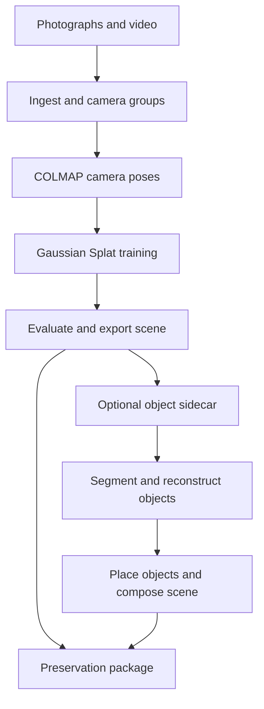

Each expensive stage writes a compact report and can be repeated independently.
The complete scene pipeline is also reachable through one command:

```bash
python -m vitrine doctor
python -m vitrine profiles
python -m vitrine run --run-dir runs/my-capture --quality standard
python -m vitrine ui --open
```

## Quick start

Requires Python 3.11+, an NVIDIA GPU, `ffmpeg`, and Docker. COLMAP runs in a
container on both supported platforms.

```bash
git clone https://github.com/ArtechShadow/UOS-Vitrine.git
cd UOS-Vitrine

python -m venv .venv
source .venv/bin/activate          # Windows: .venv\Scripts\activate
pip install -r requirements.txt

docker pull colmap/colmap:latest
python -m vitrine doctor
python -m vitrine ui --open
```

Validated on Linux with an RTX 3060 Laptop GPU and Windows 11 with an RTX 5090.
The reconstruction algorithm remains the same; hardware profiles change the
measured resolution, crop, Gaussian cap and iteration settings.

## Capturing and reconstructing a scene

Place source media into separate folders for each camera group. This separation
is functional, not cosmetic: mixing a high-resolution still and a video frame
under one set of camera intrinsics can silently warp the reconstruction.

```text
source/
├── stills/     photographs — the preservation master
└── video/      walkthrough — fills gaps between stills
```

Run the complete scene workflow:

```bash
python -m vitrine run \
    --run-dir runs/my-capture \
    --quality standard \
    --title "My Installation" \
    --subject "What was captured and why it matters."
```

Or work stage by stage:

```bash
python -m vitrine --run-dir runs/my-capture ingest
python -m vitrine --run-dir runs/my-capture sfm
python -m vitrine --run-dir runs/my-capture train
python -m vitrine --run-dir runs/my-capture evaluate
python -m vitrine --run-dir runs/my-capture package --title "..." --subject "..."
```

Always make a `draft` while the subject still exists. It answers the most
important early question — whether the capture has enough overlap to register —
before a temporary installation is dismantled.

## Object segmentation and reconstruction

Object processing is optional and deliberately separated from the core
MIT-licensed environment. Vitrine invokes an external reconstruction sidecar
as a subprocess, keeping its heavyweight dependencies and model licences out
of this repository.

```bash
python -m vitrine --run-dir runs/my-capture objects \
    --sidecar /path/to/object-sidecar
```

The sidecar consumes a Vitrine run read-only and can:

- identify candidate objects with GroundingDINO prompts;
- segment them per frame with SAM3.1;
- rectify masks and images into an explicitly recorded camera domain;
- carve coherent 3D object candidates using front-depth-band gating and
  multi-view evidence;
- choose photographic seed views by silhouette, sharpness and coverage;
- generate alternative object reconstructions;
- score candidates against real photographs, masks and recovered cameras;
- estimate position, orientation and scale within the scene;
- bake photographed detail onto observed texture regions;
- record generated filling separately for surfaces that were never observed;
- emit individual GLB assets and an optional composed glTF scene.

The research harness has evaluated reconstruction lanes including
**TRELLIS.2** and **ReconViaGen**. Current rankings are evidence for the tested
Nested Cinema objects, not claims of universal model superiority.

### From photograph to reusable object

The examples below show real seed photographs paired with Lane-A TRELLIS.2
reconstructions of the radio, table and speaker, followed by turntable views
from angles that were not present in the conditioning photograph.

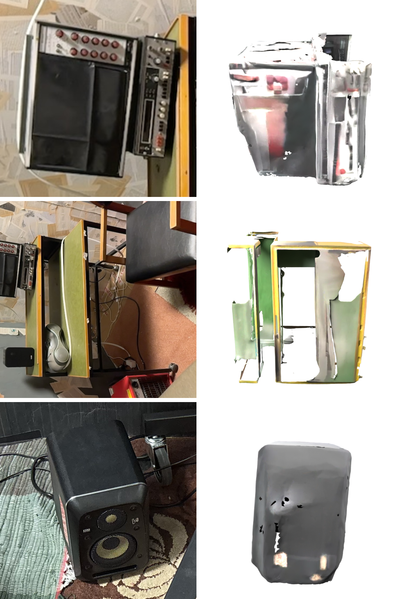

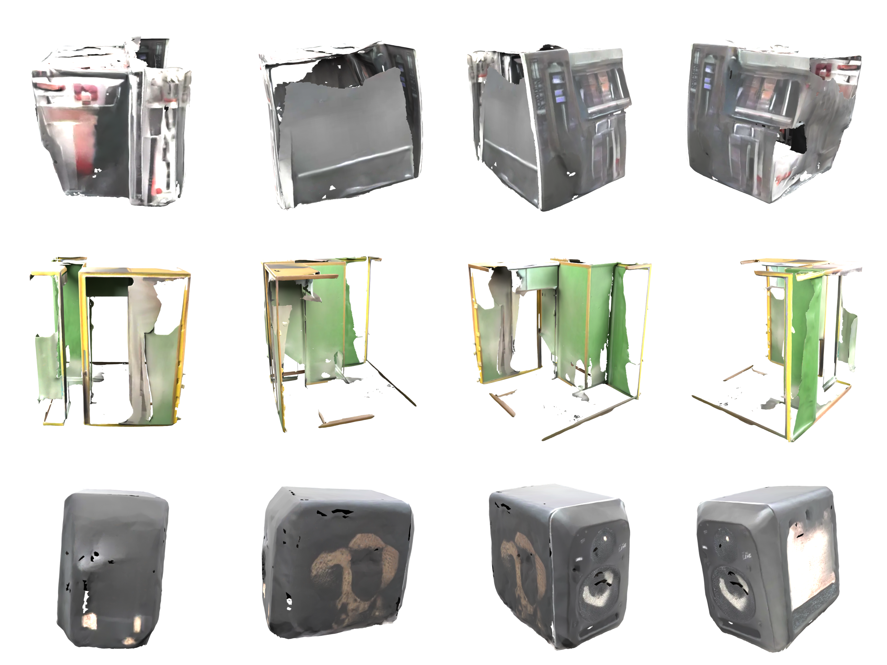

### Comparing reconstruction approaches

Candidate selection is evidence-based. The radio comparison below places the
Lane-A and Lane-B results side by side; the current instance-aware evaluation
ranks Lane A first for this tested object, while retaining the limitations of
single-object evidence.

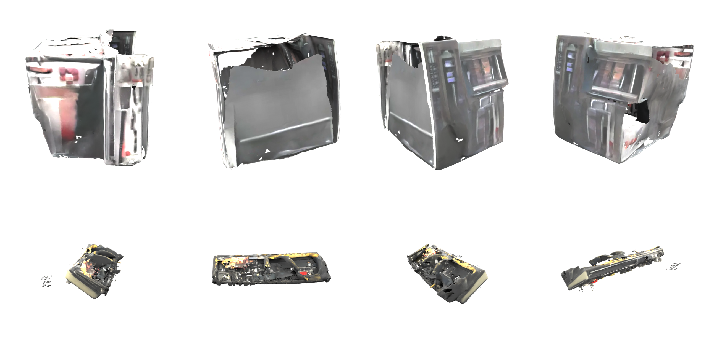

### A secure file boundary

The sidecar writes a versioned contract rather than importing code into the
preservation pipeline:

```text
runs/<name>/objects/
├── objects.json             schema: vitrine/object/1
├── object meshes and previews
└── optional composed scene
```

Before accepting output, Vitrine validates the schema, safe relative paths,
mesh references, transforms, coverage and confidence values. Checksums are
recomputed rather than trusted, and symlinks, traversal paths, duplicate IDs
and malformed records are rejected.

Validated assets are archived under `derivatives/objects/`. The preservation
manifest records stable per-object metadata and labels the composed scene as a
derivative that may combine observed and generated content.

The composed-scene proof places reconstructed assets back into the recovered
environment. It is presented as a derivative rather than raw capture evidence.

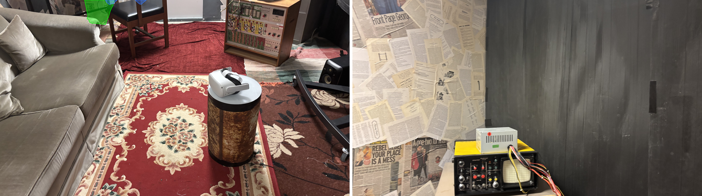

## Measured scene results

| Run | Hardware | Views | PSNR | SSIM | Time |
|---|---|---:|---:|---:|---:|
| `nested-cinema-01` | RTX 3060 Laptop, 6 GB | 222 | 25.72 dB | 0.817 | 60.4 min |
| `nested-cinema-01-5090-control` | RTX 5090 | 222 | 25.06 dB | 0.821 | **2.4 min** (~25×) |
| `nested-cinema-04-master` | RTX 5090 | 736 | 22.91 dB | 0.778 | 8.7 min |

The 5090 control reproduces the laptop recipe at approximately the same quality
in a fraction of the time. The larger `nested-cinema-04-master` result is scored
against a broader and more difficult held-out set spanning five camera groups,
so its figures are not directly comparable with the 222-view baseline.

Quality is measured rather than asserted: every eighth view is held out of
training, and PSNR and SSIM are recorded against photographs the optimiser did
not see.

### Reconstruction evidence

The current master registers **736 views across five calibrated camera
groups** and retains **404,570 sparse COLMAP points**. The visualisations below
come from the real reconstruction rather than a synthetic example.

| Registered sparse point cloud | Recovered camera coverage |
|---|---|
| 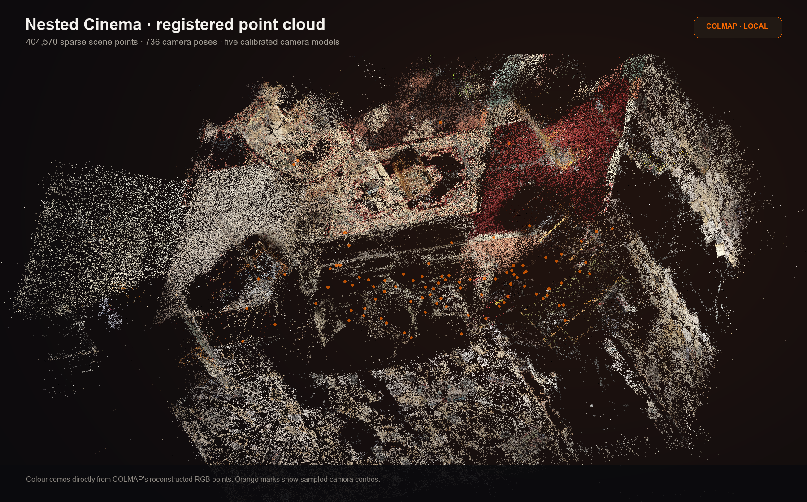 | 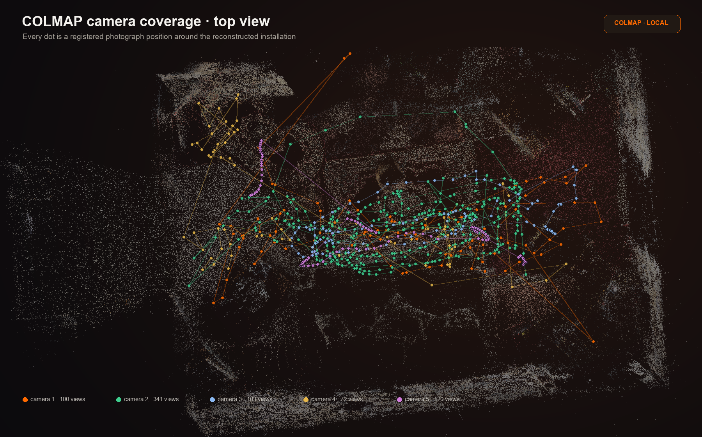 |

The matched-view comparison shows a source photograph beside a render from the
same recovered camera. It makes both the achievement and the remaining loss of
fine newspaper and fabric detail visible.

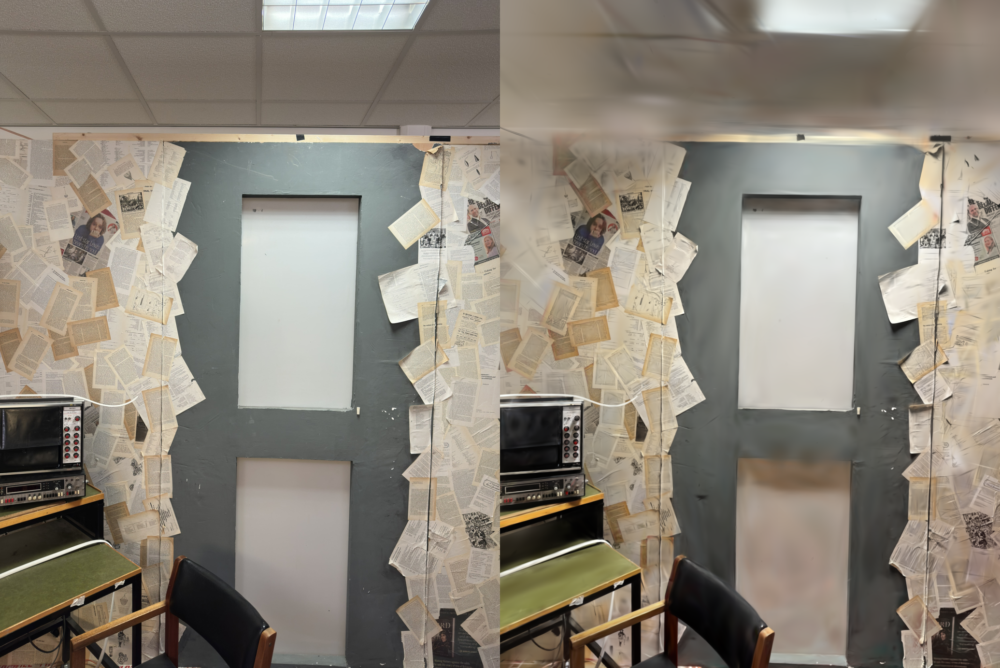

## Research findings

### Lens distortion was the largest quality fault

COLMAP recovered real radial distortion for every camera, while the gsplat
rasteriser assumed an ideal pinhole model. Correcting images and intrinsics
before training improved the matched 736-view experiment by **4.93 dB PSNR**,
**0.155 SSIM**, and raised live Gaussians from **6.3% to 42.6%**.

This also explained why large crops had appeared harmful: they reached further
into the uncorrected image corners. Full record:
[`docs/undistortion-finding.md`](docs/undistortion-finding.md).

### Frame coverage controls training health

A random crop must revisit enough of each frame for reconstruction gradients to
counter global opacity and scale regularisation. In the measured tests, crop
coverage below approximately 50% collapsed the live Gaussian population.

The validated high-quality recipe uses a 2304-pixel source with a 1536-pixel
crop (67% coverage). Full record:
[`docs/nested-cinema-04-master.md`](docs/nested-cinema-04-master.md).

### Object carving needs depth-aware evidence

Naively voting for every Gaussian along a masked camera ray contaminates an
object with occluded geometry behind it. The current sidecar contract uses a
front-depth band, multi-view thresholds and connected-component cleanup. The
latest Nested Cinema radio test reduced the carve to a clean 2,093-Gaussian
cluster after correcting an outlier-inflated depth band.

## Quality profiles

```bash
python -m vitrine profiles
```

| | draft | standard | archive |
|---|---|---|---|
| Purpose | Check capture registration | Reliable working result | Deposit-oriented testing |
| Laptop, 6 GB | ~3 min | ~40 min | ~110 min |
| Workstation, 24–32 GB | ~3 min | ~60 min | ~275 min estimated |

> **Known gap:** the workstation `archive` preset (`crop=1600`,
> `source_long_edge=4096`) remains unvalidated and can suffer opacity collapse.
> Use `standard`, or reproduce the best measured high-quality result with
> [`scripts/run_nested_cinema_04_master.py`](scripts/run_nested_cinema_04_master.py),
> until the profile is revalidated.

## What comes out

```text
runs/<name>/
├── ingest/      staged frames and selection report
├── sfm/         COLMAP database, camera poses and sparse reconstruction
├── model/       full-SH scene.ply and measured results
├── objects/     optional sidecar manifest and per-object assets
└── archive/     checksummed preservation package
```

The archive can contain:

```text
archive/
├── originals/             untouched source photographs and video
├── sfm/                   camera poses and sparse cloud in plain text
├── model/                 full spherical-harmonic Gaussian Splat
├── derivatives/
│   ├── web access copies and conventional geometry
│   └── objects/           validated object meshes and composed scene
├── manifest.json          versions, parameters, metrics and SHA-256 inventory
└── README.md              plain-language preservation record
```

Verify a package later with:

```bash
python -m vitrine verify runs/my-capture/archive
```

Checksums detect change or corruption; they complement rather than replace a
real backup and preservation policy.

## Honest limitations

- A Gaussian Splat is an interpolation, not a direct geometric measurement.
- Surfaces that were never photographed must be inferred.
- Reflective, transparent and moving materials remain difficult.
- Object reconstructions can contain generated geometry or texture on unseen
  surfaces; Vitrine records that distinction rather than hiding it.
- COLMAP scale is arbitrary unless the capture includes an external scale
  reference.
- PSNR and SSIM measure novel-view appearance, not absolute geometric accuracy.

These limitations are part of the preservation record because uncertainty is
information, not an implementation detail.

## Documentation

| Document | What it covers |
|---|---|
| [`AGENTS.md`](AGENTS.md) | Design rationale, measurements and environment traps |
| [`docs/capture-sop.md`](docs/capture-sop.md) | How to photograph a room for reconstruction |
| [`docs/preservation.md`](docs/preservation.md) | Archive structure, provenance and limitations |
| [`docs/undistortion-finding.md`](docs/undistortion-finding.md) | Lens-distortion investigation and measured fix |
| [`docs/nested-cinema-04-master.md`](docs/nested-cinema-04-master.md) | Full record behind the current scene result |
| [`docs/PROJECT-PLAN.md`](docs/PROJECT-PLAN.md) | Roadmap and module status |
| [`docs/progress.md`](docs/progress.md) | Backward-looking implementation record |
| [`report/closeout-report.pdf`](report/closeout-report.pdf) | Scene and object reconstruction closeout report |

## Project boundaries and collaboration

The core UOS Vitrine repository owns scene capture, Gaussian Splat training,
evaluation, archive packaging, the local GUI, and the secure contract through
which object assets enter the preservation record.

The object-segmentation and reconstruction models remain a separate sidecar.
This separation protects the MIT-licensed core from incompatible model and
software licences while preserving a stable, checksummed file handoff.

Vitrine is developed in collaboration with **DreamLab AI**. The separate
GPL-licensed [DreamLab-AI/Vitrine](https://github.com/DreamLab-AI/Vitrine)
stack explores downstream segmentation, meshing and Unreal Engine delivery.
The projects share a research direction but remain distinct codebases.

## Acknowledgements

Built at the **XR Lab, University of Salford**, for the preservation of
*Nested Cinema — Vera's Not Alone* by Dr Pavel Prokopic, MediaCityUK, in
collaboration with **DreamLab AI**.

<p align="left">
  
  &nbsp;&nbsp;
  
  &nbsp;&nbsp;
  
</p>

## Licence

[MIT](LICENSE)
